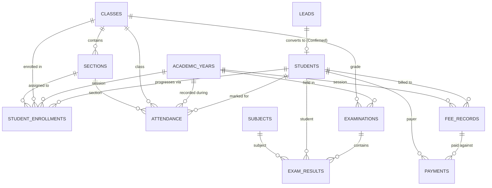

# 🏫 School Management System (Zoho CRM & Zoho Creator)

[](https://crm.zoho.in)
[](https://creator.zoho.in)
[](https://www.zoho.com/deluge/)
[](https://www.zoho.com/crm/developer/docs/client-script/)

An enterprise-grade, relational **School Management System** designed and deployed on **Zoho CRM** and **Zoho Creator**. The solution delivers a normalized academic data model, robust server-side business rules, instant browser-level pre-save validations, automated workflows, custom CRM analytics, and an integrated **Parent Portal**.

---

## 📂 Repository Structure

```
School-Management-System-Zoho/
├── client_scripts/                 # ZDK JavaScript Pre-Save Client Scripts
│   ├── attendance_presave_validation.js
│   ├── exam_result_presave_validation.js
│   └── payment_presave_validation.js
├── deluge/                         # Server-side Deluge Automation Scripts
│   ├── calculate_student_attendance_percentage.deluge
│   ├── lead_to_student_conversion.deluge
│   ├── recalculate_fee_record_and_validate_payment.deluge
│   ├── validate_and_calculate_exam_results.deluge
│   ├── validate_attendance.deluge
│   ├── validate_examination.deluge
│   └── validate_student_enrollment.deluge
├── reports/                        # CRM Analytics & Report Configurations
│   ├── attendance_reports_config.md
│   ├── examination_reports_config.md
│   └── fee_payment_reports_config.md
├── schema/                         # Relational Data Model & Architecture
│   └── data_model.md
├── webforms/                       # Public Webform & Portal Templates
│   ├── admission_enquiry_webform.html
│   └── creator_parent_portal_page.deluge
├── workflows/                      # CRM Workflow Rules Configuration
│   ├── academic_enrollment_config.md
│   ├── admission_workflow_config.md
│   ├── attendance_workflow_config.md
│   └── fee_payment_workflow_config.md
├── README.md                       # Project Overview & Repository Index
└── SUBMISSION_DOCUMENTATION.md     # Complete Technical Design Documentation
```

---

## 🏛️ System Architecture & Data Model

The data architecture establishes **Zoho CRM** as the central system of record with 12 custom relational modules:



### Module Inventory:
1. **`Leads`:** Admission enquiry pipeline (`New` $\to$ `Contacted` $\to$ `Follow-up` $\to$ `Confirmed`/`Rejected`).
2. **`Students` (`CustomModule4`):** Master student identity registry.
3. **`Academic Years` (`CustomModule5`):** Intake session management.
4. **`Classes` (`CustomModule6`):** Standard grade levels.
5. **`Sections` (`CustomModule7`):** Class subdivisions.
6. **`Subjects` (`CustomModule8`):** Academic curriculum subjects.
7. **`Teachers` (`CustomModule9`):** Faculty master directory.
8. **`Student Enrollments` (`CustomModule10`):** Relational progression tracking.
9. **`Attendance` (`CustomModule11`):** Daily classroom attendance tracking.
10. **`Examinations` (`CustomModule1`):** Term examination schedules.
11. **`Exam Results` (`CustomModule2`):** Granular marks, percentages, grades, and pass/fail statuses.
12. **`Fee Records` (`CustomModule12`):** Master student fee structures.
13. **`Payments` (`CustomModule3`):** Installment transaction receipts.

---

## ⚡ Core Automations & Deluge Scripts

| Script File | Trigger / Module | Business Logic |
|---|---|---|
| [`lead_to_student_conversion.deluge`](file:///e:/School-Management-System-Zoho/deluge/lead_to_student_conversion.deluge) | `Leads` (On Confirmed) | Idempotently creates Student with unique `STU-xxxxx` ID. |
| [`validate_examination.deluge`](file:///e:/School-Management-System-Zoho/deluge/validate_examination.deluge) | `Examinations` (Create/Edit) | Validates `End Date >= Start Date` within Academic Year bounds. |
| [`validate_and_calculate_exam_results.deluge`](file:///e:/School-Management-System-Zoho/deluge/validate_and_calculate_exam_results.deluge) | `Exam Results` (Create/Edit) | Computes %, assigns Letter Grades (A+, A, B+, B, C, D, F) & Pass/Fail with recursion guard. |
| [`recalculate_fee_record_and_validate_payment.deluge`](file:///e:/School-Management-System-Zoho/deluge/recalculate_fee_record_and_validate_payment.deluge) | `Payments` (Create/Edit) | Aggregates payments, calculates Collected/Outstanding amounts, updates Status (`Paid`/`Partially Paid`/`Overdue`). |
| [`validate_student_enrollment.deluge`](file:///e:/School-Management-System-Zoho/deluge/validate_student_enrollment.deluge) | `Student Enrollments` | Prevents duplicate student enrollment within the same academic year. |
| [`validate_attendance.deluge`](file:///e:/School-Management-System-Zoho/deluge/validate_attendance.deluge) | `Attendance` (Create/Edit) | Validates student status and blocks duplicate attendance on the same date. |

---

## 🛡️ Client Scripts (Pre-Save Browser Validation)

* [`attendance_presave_validation.js`](file:///e:/School-Management-System-Zoho/client_scripts/attendance_presave_validation.js): Blocks submission if student is inactive or date is invalid.
* [`exam_result_presave_validation.js`](file:///e:/School-Management-System-Zoho/client_scripts/exam_result_presave_validation.js): Prevents negative marks or marks exceeding `Maximum Marks`.
* [`payment_presave_validation.js`](file:///e:/School-Management-System-Zoho/client_scripts/payment_presave_validation.js): Ensures positive payment amounts and checks transaction reference uniqueness.

---

## 📊 Live CRM Reports & Analytics

1. **`Fee Collection Summary`:** Summary matrix on `Payments` grouped by `Payment Method` with sum of `Amount Paid`.
2. **`Payment History`:** Detailed student transaction ledger sorted chronologically.
3. **`Outstanding Students`:** Defaulter report tracking students with pending fee balances.

---

## 📱 Zoho Creator Parent Portal

* **Live App URL:** `https://creatorapp.zoho.in/nikkybaliyan723/school-parent-portal/#Page:Students_Dashboard`
* **Microservice Connection:** `zoho_crm_connection` configured and authorized with CRM API scopes.
* **Parent Dashboard:** Renders Student Profile, Attendance Rate, Exam Results Table, and Fee/Payment Ledger.

---

## 📖 Complete Documentation
For full architectural details, ER diagrams, test summaries, and known limitations, refer to:  
👉 [`SUBMISSION_DOCUMENTATION.md`](file:///e:/School-Management-System-Zoho/SUBMISSION_DOCUMENTATION.md)