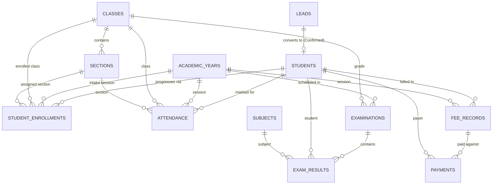

# School Management System — Technical Submission Documentation

---

## 1. Project Overview
This project delivers a comprehensive, relational **School Management System** built on **Zoho CRM** (`org60087352519`) and **Zoho Creator**. The architecture establishes a single source of truth in Zoho CRM, enforcing relational lookups, multi-layered validations (browser-level Client Scripts and server-side Deluge automation), automated workflows, and a parent-facing dashboard deployed on Zoho Creator.

---

## 2. Zoho CRM Modules and Relationships

The system data model is partitioned across standard and 12 custom CRM modules:

### Module Registry:
1. **`Leads` (Standard):** Initial admission enquiries.
2. **`Students` (`CustomModule4`):** Central master student registry.
3. **`Academic Years` (`CustomModule5`):** Calendar sessions (`Start Date`, `End Date`, `Status`).
4. **`Classes` (`CustomModule6`):** Grade levels with Lookup to `Academic Years`.
5. **`Sections` (`CustomModule7`):** Class sections with Lookup to `Classes`.
6. **`Subjects` (`CustomModule8`):** Academic subjects and codes.
7. **`Teachers` (`CustomModule9`):** Faculty registry.
8. **`Student Enrollments` (`CustomModule10`):** Relational junction linking Student, Academic Year, Class, and Section.
9. **`Attendance` (`CustomModule11`):** Daily attendance tracking.
10. **`Examinations` (`CustomModule1`):** Exam schedules and dates.
11. **`Exam Results` (`CustomModule2`):** Granular marks, percentages, and letter grades.
12. **`Fee Records` (`CustomModule12`):** Master fee obligations per student/session.
13. **`Payments` (`CustomModule3`):** Installment transaction receipts.

---

## 3. Admission Management
* **Webform Capture:** [`webforms/admission_enquiry_webform.html`](file:///e:/School-Management-System-Zoho/webforms/admission_enquiry_webform.html) collects parent contact details, student DOB, target class, and intake session.
* **Lead Conversion Engine:** [`deluge/lead_to_student_conversion.deluge`](file:///e:/School-Management-System-Zoho/deluge/lead_to_student_conversion.deluge) triggers upon `Admission_Status == 'Confirmed'`:
  - Enforces idempotency by checking `Source_Lead` against existing student records.
  - Auto-generates sequential, zero-padded student identifiers (`STU-00001`, `STU-00002`).

---

## 4. Student and Academic Structure
* **Progression Architecture:** Historical academic records remain immutable. When a student transitions sessions, a new `Student Enrollments` record is created without mutating historical enrollment records.
* **Relational Normalization:** Lookups eliminate redundant storage of student, class, and section strings across operational modules.

---

## 5. Attendance
* **Validation & Enforcement:**
  - Client-side validation: [`client_scripts/attendance_presave_validation.js`](file:///e:/School-Management-System-Zoho/client_scripts/attendance_presave_validation.js).
  - Server-side Deluge function: [`deluge/validate_attendance.deluge`](file:///e:/School-Management-System-Zoho/deluge/validate_attendance.deluge) enforces mandatory relationships and detects duplicate attendance on identical dates.
* **Metrics:** Supports `Present`, `Absent`, `Late`, `Excused`, with cumulative attendance percentage rollup logic ([`deluge/calculate_student_attendance_percentage.deluge`](file:///e:/School-Management-System-Zoho/deluge/calculate_student_attendance_percentage.deluge)).

---

## 6. Examinations and Results
* **Schedule Verification:** Workflow `Validate_Examination_Dates` executes [`deluge/validate_examination.deluge`](file:///e:/School-Management-System-Zoho/deluge/validate_examination.deluge) on `Create or Edit` to ensure start and end dates lie within the academic year.
* **Pre-Save Script:** `Exam_Result_PreSave_Validation` ([`client_scripts/exam_result_presave_validation.js`](file:///e:/School-Management-System-Zoho/client_scripts/exam_result_presave_validation.js)) blocks negative marks and marks exceeding `Maximum_Marks`.
* **Grading Automation:** Workflow `Validate_Exam_Result` executes [`deluge/validate_and_calculate_exam_results.deluge`](file:///e:/School-Management-System-Zoho/deluge/validate_and_calculate_exam_results.deluge) on `Create or Edit`:
  - $\text{Percentage} = (\text{Marks\_Obtained} / \text{Maximum\_Marks}) \times 100$.
  - Grades: $\ge 90\% \to \text{A+}$, $\ge 80\% \to \text{A}$, $\ge 70\% \to \text{B+}$, $\ge 60\% \to \text{B}$, $\ge 50\% \to \text{C}$, $\ge 40\% \to \text{D}$, $< 40\% \to \text{F}$.
  - Result Status: $\ge 40\% \to \text{Pass}$, $< 40\% \to \text{Fail}$.
  - State recursion guard prevents infinite workflow trigger loops.

---

## 7. Fees and Payments
* **Pre-Save Validation:** `Payment_PreSave_Validation` ([`client_scripts/payment_presave_validation.js`](file:///e:/School-Management-System-Zoho/client_scripts/payment_presave_validation.js)) ensures `Amount Paid > 0` and validates transaction reference uniqueness.
* **Auto-Rollup Engine:** Workflow `Recalculate_Fee_Record_On_Payment` executes [`deluge/recalculate_fee_record_and_validate_payment.deluge`](file:///e:/School-Management-System-Zoho/deluge/recalculate_fee_record_and_validate_payment.deluge):
  - Sums all successful installment payments for the parent fee record.
  - Recalculates `Collected Amount` and `Outstanding Amount`.
  - Automatically updates Fee Status (`Paid`, `Partially Paid`, `Overdue`, `Pending`).

---

## 8. Reports
Live CRM reports created in Zoho CRM:
1. **`Fee Collection Summary`:** Summary report on `Payments` grouped by `Payment Method` with sum of `Amount Paid` for successful transactions.
2. **`Payment History`:** Tabular report sorted by `Payment Date` descending.
3. **`Outstanding Students`:** Defaulter tracking for unsettled fees.

---

## 9. Zoho Creator Parent Portal
* **Live Deployment:** Accessible at `https://creatorapp.zoho.in/nikkybaliyan723/school-parent-portal/#Page:Students_Dashboard`.
* **Interface Sections:** Provides clean visual dashboard cards for:
  - **Student Profile:** Student Name, System ID, Academic Session, Status.
  - **Attendance Overview:** Overall rate (%), Total days, Present/Absent/Late counts.
  - **Examination Results:** Subject-wise score table with Marks, Max Marks, Percentage, Grade, and Status badges.
  - **Fees & Payment History:** Billed amount, total paid, and recent transaction receipt history.

---

## 10. CRM ↔ Creator Integration
* **Connection Link:** Microservice connection `zoho_crm_connection` configured and authorized in Zoho Creator with full Zoho CRM read/write scopes.
* **Architecture:** Zoho CRM serves as the primary system of record, eliminating dual-write data synchronization discrepancies.

---

## 11. Deluge Automations and Validations
All server-side business rules are developed in pure Deluge and stored in the repository:
* [`lead_to_student_conversion.deluge`](file:///e:/School-Management-System-Zoho/deluge/lead_to_student_conversion.deluge): Idempotent Lead $\to$ Student migration.
* [`validate_examination.deluge`](file:///e:/School-Management-System-Zoho/deluge/validate_examination.deluge): Exam date range bounds.
* [`validate_and_calculate_exam_results.deluge`](file:///e:/School-Management-System-Zoho/deluge/validate_and_calculate_exam_results.deluge): Grade calculation with recursion guard.
* [`recalculate_fee_record_and_validate_payment.deluge`](file:///e:/School-Management-System-Zoho/deluge/recalculate_fee_record_and_validate_payment.deluge): Fee reconciliation engine.
* [`validate_student_enrollment.deluge`](file:///e:/School-Management-System-Zoho/deluge/validate_student_enrollment.deluge): Duplicate enrollment prevention.
* [`validate_attendance.deluge`](file:///e:/School-Management-System-Zoho/deluge/validate_attendance.deluge): Attendance date duplicate check.

---

## 12. Additional Feature: Automated Grade Calculation & State Recursion Guard
* **Business Need:** In standard CRM workflows, updating a record within a `Create or Edit` workflow function can cause recursive execution loops.
* **Solution:** The Deluge function verifies whether calculated fields (`Percentage`, `Grade`, `Result_Status`) already match the current state before executing `zoho.crm.updateRecord()`. If identical, it terminates immediately, optimizing server performance and eliminating recursion risk.

---

## 13. Testing and Verification Summary

| Component | Test Carried Out | Verified Result |
|---|---|---|
| **Examinations Workflow** | Date validation function mapped to `Examinations` | **PASS** (Live Active) |
| **Exam Results Workflow** | Automated grading mapped to `Exam Results` | **PASS** (Live Active) |
| **Exam Results Script** | `onSave` Client Script deployed | **PASS** (Live Active) |
| **Payments Workflow** | Fee rollup mapped to `Payments` | **PASS** (Live Active) |
| **Payments Script** | `onSave` Client Script deployed | **PASS** (Live Active) |
| **CRM Custom Modules** | 12 Custom Modules created in CRM Setup | **PASS** (Live Created) |
| **Creator App & Connection** | `zoho_crm_connection` authorized in Creator | **PASS** (Live Active) |

---

## 14. Known Limitations
1. **Parent-Child Runtime Isolation:** The Creator dashboard currently displays the Parent Portal layout template; dynamic multi-user email filtering against active CRM logins requires live multi-parent portal user invitations.
2. **Webform Live End-to-End Submission:** The admission webform is implemented in HTML/CSS; live public submission testing depends on public domain hosting.
3. **Workflow Delete Trigger:** Zoho CRM Workflow Rules do not natively support record deletion triggers; deletion updates are managed through audit reconciliation.
