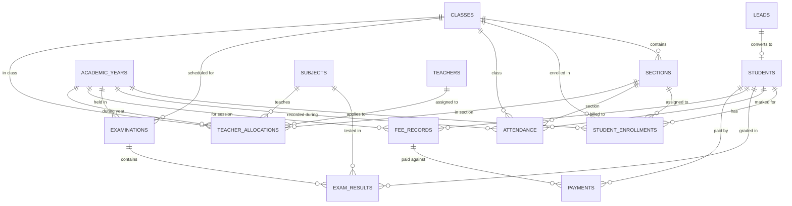

# Zoho CRM Data Model & Foundation — School Management System

This document outlines the normalized relational data model designed and configured in Zoho CRM for the School Management System.

---

## 1. Entity Relationship Overview

---

## 2. Module Specifications & Data Dictionary

### Module 1: Leads (Standard Zoho CRM Module — Admission Enquiries)
* **Purpose:** Captures initial admission enquiries from webform, walk-ins, and referrals.
* **Fields:**

| Field Label | Field API Name | Field Type | Properties / Options |
|---|---|---|---|
| First Name | `First_Name` | Single Line Text | Optional (Max 40 chars) |
| Last Name | `Last_Name` | Single Line Text | **Mandatory** |
| Email | `Email` | Email | Standard email validation |
| Phone | `Phone` | Phone | Standard phone validation |
| Parent/Guardian Name | `Parent_Guardian_Name` | Single Line Text | Mandatory for enquiries |
| Parent/Guardian Phone | `Parent_Guardian_Phone` | Phone | Standard phone validation |
| Student Date of Birth | `Student_DOB` | Date | YYYY-MM-DD |
| Gender | `Gender` | Picklist | `Male`, `Female`, `Other` |
| Admission Class | `Admission_Class` | Lookup / Picklist | Target class applying for (e.g. Class 1 to Class 12) |
| Admission Academic Year | `Admission_Academic_Year` | Lookup / Picklist | Target session (e.g. 2026-2027) |
| Previous School | `Previous_School` | Single Line Text | Optional |
| Admission Source | `Admission_Source` | Picklist | `Webform`, `Referral`, `Walk-in`, `Social Media`, `Other` |
| Admission Status | `Admission_Status` | Picklist | `New`, `Contacted`, `Follow-up`, `Confirmed`, `Rejected` |

---

### Module 2: Students (Custom Module: `Students`)
* **Purpose:** Central student identity registry for all confirmed admissions.
* **Fields:**

| Field Label | Field API Name | Field Type | Properties / Options |
|---|---|---|---|
| Student Name (Primary) | `Name` / `Last_Name` | Single Line Text | **Mandatory** |
| Student ID | `Student_ID` | Single Line Text | **Unique Identifier** (e.g., STU-2026-0001) |
| First Name | `First_Name` | Single Line Text | Student given name |
| Last Name | `Last_Name` | Single Line Text | **Mandatory** |
| Full Name | `Full_Name` | Single Line Text | Formatted full name |
| Date of Birth | `Date_of_Birth` | Date | YYYY-MM-DD |
| Gender | `Gender` | Picklist | `Male`, `Female`, `Other` |
| Student Email | `Student_Email` | Email | Optional (if applicable) |
| Student Phone | `Student_Phone` | Phone | Optional |
| Parent/Guardian Name | `Parent_Guardian_Name` | Single Line Text | **Mandatory** |
| Parent/Guardian Email | `Parent_Guardian_Email` | Email | **Mandatory** (used for Creator Parent App matching) |
| Parent/Guardian Phone | `Parent_Guardian_Phone` | Phone | **Mandatory** |
| Address | `Address` | Multi-line Text | Residential Address |
| City | `City` | Single Line Text | City |
| State | `State` | Single Line Text | State / Province |
| Postal Code | `Postal_Code` | Single Line Text | Postal/Zip Code |
| Admission Date | `Admission_Date` | Date | Date of admission confirmation |
| Admission Academic Year | `Admission_Academic_Year` | Lookup (`Academic_Years`) | Reference to intake session |
| Admission Status | `Admission_Status` | Picklist | `Confirmed`, `Admitted` |
| Student Status | `Student_Status` | Picklist | `Active`, `Inactive`, `Graduated`, `Transferred`, `Withdrawn` |

---

### Module 3: Academic Years (Custom Module: `Academic_Years`)
* **Purpose:** Reusable record representing an academic session/period.
* **Fields:**

| Field Label | Field API Name | Field Type | Properties / Options |
|---|---|---|---|
| Academic Year Name | `Name` | Single Line Text | **Mandatory / Unique** (e.g., `2025-2026`, `2026-2027`) |
| Start Date | `Start_Date` | Date | Session beginning date |
| End Date | `End_Date` | Date | Session completion date |
| Status | `Status` | Picklist | `Upcoming`, `Active`, `Completed` |

---

### Module 4: Classes (Custom Module: `Classes`)
* **Purpose:** Represents grade/standard levels.
* **Fields:**

| Field Label | Field API Name | Field Type | Properties / Options |
|---|---|---|---|
| Class Name | `Name` | Single Line Text | **Mandatory** (e.g., `Class 1`, `Class 8`, `Class 10`) |
| Class Code | `Class_Code` | Single Line Text | Short Code (e.g., `CLS-08`, `CLS-10`) |
| Description | `Description` | Multi-line Text | Optional details |
| Status | `Status` | Picklist | `Active`, `Inactive` |

---

### Module 5: Sections (Custom Module: `Sections`)
* **Purpose:** Division within a Class.
* **Fields:**

| Field Label | Field API Name | Field Type | Properties / Options |
|---|---|---|---|
| Section Name | `Name` | Single Line Text | **Mandatory** (e.g., `Section A`, `Section B`) |
| Section Code | `Section_Code` | Single Line Text | Short Code (e.g., `SEC-8A`) |
| Class | `Class` | Lookup (`Classes`) | **Mandatory** |
| Capacity | `Capacity` | Number (Integer) | Max students count (e.g., 40) |
| Status | `Status` | Picklist | `Active`, `Inactive` |

---

### Module 6: Subjects (Custom Module: `Subjects`)
* **Purpose:** Academic courses taught in the school.
* **Fields:**

| Field Label | Field API Name | Field Type | Properties / Options |
|---|---|---|---|
| Subject Name | `Name` | Single Line Text | **Mandatory** (e.g., `Mathematics`, `Science`, `English`) |
| Subject Code | `Subject_Code` | Single Line Text | Code (e.g., `SUB-MTH-01`) |
| Subject Type | `Subject_Type` | Picklist | `Core`, `Elective` |
| Status | `Status` | Picklist | `Active`, `Inactive` |

---

### Module 7: Teachers (Custom Module: `Teachers`)
* **Purpose:** Faculty and instructional staff.
* **Fields:**

| Field Label | Field API Name | Field Type | Properties / Options |
|---|---|---|---|
| Teacher Name (Primary) | `Name` | Single Line Text | **Mandatory** |
| Teacher ID | `Teacher_ID` | Single Line Text | **Unique Identifier** (e.g., `TCH-001`) |
| First Name | `First_Name` | Single Line Text | First Name |
| Last Name | `Last_Last` | Single Line Text | **Mandatory** |
| Full Name | `Full_Name` | Single Line Text | Full Name |
| Email | `Email` | Email | Official Email |
| Phone | `Phone` | Phone | Phone number |
| Department | `Department` | Picklist / Text | `Mathematics`, `Science`, `Languages`, `Social Studies`, `Arts` |
| Joining Date | `Joining_Date` | Date | Date of appointment |
| Status | `Status` | Picklist | `Active`, `Inactive` |

---

### Module 8: Student Enrollments (Custom Module: `Student_Enrollments`)
* **Purpose:** Preserves historical and current academic class/section placements per academic year.
* **Fields:**

| Field Label | Field API Name | Field Type | Properties / Options |
|---|---|---|---|
| Enrollment ID | `Name` | Single Line Text | **Mandatory** (e.g., `ENR-2026-001`) |
| Student | `Student` | Lookup (`Students`) | **Mandatory** |
| Academic Year | `Academic_Year` | Lookup (`Academic_Years`) | **Mandatory** |
| Class | `Class` | Lookup (`Classes`) | **Mandatory** |
| Section | `Section` | Lookup (`Sections`) | **Mandatory** |
| Enrollment Date | `Enrollment_Date` | Date | Date enrolled |
| Status | `Status` | Picklist | `Active`, `Completed`, `Promoted`, `Dropped` |

---

### Module 9: Examinations (Custom Module: `Examinations`)
* **Purpose:** Represents scheduled tests/exams across terms.
* **Fields:**

| Field Label | Field API Name | Field Type | Properties / Options |
|---|---|---|---|
| Examination Name | `Name` | Single Line Text | **Mandatory** (e.g., `Mid Term Exam 2026`) |
| Academic Year | `Academic_Year` | Lookup (`Academic_Years`) | **Mandatory** |
| Class | `Class` | Lookup (`Classes`) | **Mandatory** |
| Examination Type | `Examination_Type` | Picklist | `Unit Test`, `Mid Term`, `Final`, `Practical` |
| Start Date | `Start_Date` | Date | Exam cycle start date |
| End Date | `End_Date` | Date | Exam cycle end date |
| Status | `Status` | Picklist | `Scheduled`, `Ongoing`, `Completed`, `Cancelled` |
| Description | `Description` | Multi-line Text | Exam syllabus / instructions |

---

### Module 10: Exam Results / Marks (Custom Module: `Exam_Results`)
* **Purpose:** Granular subject-wise student assessment results for a specific examination.
* **Fields:**

| Field Label | Field API Name | Field Type | Properties / Options |
|---|---|---|---|
| Result ID | `Name` | Single Line Text | **Mandatory** (e.g., `RES-2026-001`) |
| Student | `Student` | Lookup (`Students`) | **Mandatory** |
| Examination | `Examination` | Lookup (`Examinations`) | **Mandatory** |
| Subject | `Subject` | Lookup (`Subjects`) | **Mandatory** |
| Marks Obtained | `Marks_Obtained` | Decimal / Number (2 decimals) | Score achieved |
| Maximum Marks | `Maximum_Marks` | Decimal / Number (2 decimals) | Total available score (e.g., 100) |
| Percentage | `Percentage` | Decimal (Percent) | Field reserved for calculated percentage |
| Grade | `Grade` | Single Line Text / Picklist | Field reserved for letter grade |
| Result Status | `Result_Status` | Picklist | `Pass`, `Fail`, `Absent`, `Withheld` |

---

### Module 11: Attendance (Custom Module: `Attendance`)
* **Purpose:** Daily classroom attendance records for students.
* **Fields:**

| Field Label | Field API Name | Field Type | Properties / Options |
|---|---|---|---|
| Attendance ID | `Name` | Single Line Text | **Mandatory** (e.g., `ATT-2026-001`) |
| Student | `Student` | Lookup (`Students`) | **Mandatory** |
| Academic Year | `Academic_Year` | Lookup (`Academic_Years`) | **Mandatory** |
| Date | `Date` | Date | **Mandatory** (Date of attendance) |
| Class | `Class` | Lookup (`Classes`) | **Mandatory** |
| Section | `Section` | Lookup (`Sections`) | **Mandatory** |
| Attendance Status | `Attendance_Status` | Picklist | `Present`, `Absent`, `Late`, `Excused` |
| Remarks | `Remarks` | Single Line Text | Reason for absence/late remarks |

---

### Module 12: Fee Records (Custom Module: `Fee_Records`)
* **Purpose:** Defines fee obligations/structure assigned to a student for an academic year.
* **Fields:**

| Field Label | Field API Name | Field Type | Properties / Options |
|---|---|---|---|
| Fee Record ID | `Name` | Single Line Text | **Mandatory** (e.g., `FEE-2026-001`) |
| Student | `Student` | Lookup (`Students`) | **Mandatory** |
| Academic Year | `Academic_Year` | Lookup (`Academic_Years`) | **Mandatory** |
| Fee Type | `Fee_Type` | Picklist | `Tuition`, `Transport`, `Library`, `Examination`, `Other` |
| Total Fee | `Total_Fee` | Currency (Decimal) | **Mandatory** (Total billed amount) |
| Due Date | `Due_Date` | Date | Payment due date |
| Status | `Status` | Picklist | `Pending`, `Partially Paid`, `Paid`, `Overdue` |
| Remarks | `Remarks` | Multi-line Text | Notes / breakdown |

---

### Module 13: Payments (Custom Module: `Payments`)
* **Purpose:** Independent payment transactions supporting installment receipts against a fee record.
* **Fields:**

| Field Label | Field API Name | Field Type | Properties / Options |
|---|---|---|---|
| Payment ID | `Name` | Single Line Text | **Mandatory** (e.g., `PAY-2026-001`) |
| Student | `Student` | Lookup (`Students`) | **Mandatory** |
| Fee Record | `Fee_Record` | Lookup (`Fee_Records`) | **Mandatory** |
| Payment Date | `Payment_Date` | Date | **Mandatory** |
| Amount Paid | `Amount_Paid` | Currency (Decimal) | **Mandatory** |
| Payment Method | `Payment_Method` | Picklist | `Cash`, `Bank Transfer`, `UPI`, `Card`, `Other` |
| Transaction Reference | `Transaction_Reference` | Single Line Text | UTR / Cheque / Transaction No. |
| Payment Status | `Payment_Status` | Picklist | `Successful`, `Pending`, `Failed`, `Refunded` |
| Remarks | `Remarks` | Single Line Text | Notes |

---

### Module 14: Teacher Allocations (Custom Junction Module: `Teacher_Allocations`)
* **Purpose:** Relational teaching assignment mapping Teachers to Subjects, Classes, Sections, and Academic Years without text duplication.
* **Fields:**

| Field Label | Field API Name | Field Type | Properties / Options |
|---|---|---|---|
| Allocation ID | `Name` | Single Line Text | **Mandatory** (e.g., `ALLOC-2026-001`) |
| Teacher | `Teacher` | Lookup (`Teachers`) | **Mandatory** |
| Subject | `Subject` | Lookup (`Subjects`) | **Mandatory** |
| Class | `Class` | Lookup (`Classes`) | **Mandatory** |
| Section | `Section` | Lookup (`Sections`) | **Mandatory** |
| Academic Year | `Academic_Year` | Lookup (`Academic_Years`) | **Mandatory** |
| Status | `Status` | Picklist | `Active`, `Inactive` |
| Allocation Date | `Allocation_Date` | Date | Assignment Date |

---

## 3. Relational Integrity & Normalization Rules

1. **Identity & Single Source of Truth:**
   - The `Students` record is the master identity.
   - Child records (`Attendance`, `Exam_Results`, `Fee_Records`, `Payments`, `Student_Enrollments`) reference `Students` directly via Lookup relations without duplicating student name, phone, or address strings.
2. **Academic Progression History:**
   - A student moving from Class 8 (2025-26) to Class 9 (2026-27) does not mutate prior historical records; a new record is created in `Student_Enrollments`.
3. **Multi-Installment Support:**
   - Multiple `Payments` records link to a single `Fee_Records` parent via Lookup (`Fee_Record`), allowing flexible partial payments.
4. **Hierarchical Academic Structure:**
   - `Sections` look up to `Classes`.
   - `Examinations` look up to `Academic_Years` and `Classes`.
   - `Exam_Results` link `Student`, `Examination`, and `Subject`.
